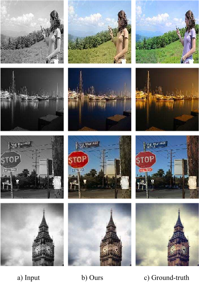

# Enhancing Image Colorization with Semantic-Guided Diffusion and Lightweight Fine-Tuning

This project implements a semantic-guided image colorization system using Stable Diffusion and dual-encoder learning.  
It includes training code for VAE fine-tuning and grayscale-to-RGB encoder alignment using a lightweight, efficient approach.

---

## Installation

Install all dependencies:

```bash
pip install -r requirements.txt
```

Make sure your environment includes a CUDA-enabled PyTorch installation.

## 🚀 Training Workflow

Before running the main training pipeline, you must fine-tune the VAE and CLIP encoders:

###  1️⃣ Fine-tune VAE
```bash

python finetune_vae.py
```
### 2️⃣ Fine-tune CLIP
```bash

python finetune_clip.py
```
### 3️⃣ Train the Full Diffusion Model

Once the VAE and CLIP are aligned, first replace the checkpoint paths in train.py, then run:
```bash

python train.py
```

## Results

After training, a sample colorized image is shown below.

This demonstrates how the model converts grayscale images into semantically meaningful color images while preserving fine details and structure.


